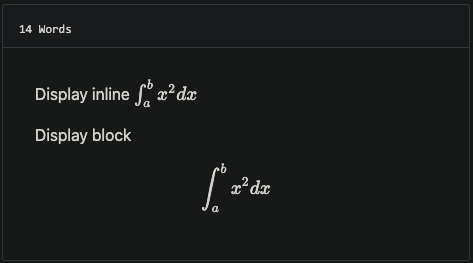

# github-style

## 初始化hugo

```bash
hugo new site mysite
cd mysite
```

## 安装主题

```bash
git submodule add git@github.com:MeiK2333/github-style.git themes/github-style
```

## 更新主题

如果您刚刚安装了主题，则它已经在最新版本中。如果没有，您可以使用以下命令进行更新

```bash
cd themes/github-style
git pull
```

然后,您需要将以前的`posts`重新命名为`post`

```bash
cd <you-project-folder>
mv content/posts content/post
```

## 设置readme.md

```bash
hugo new readme.md
echo '`Hello World!`' > content/readme.md
```

## 设置Pin post

```
---
pin: true
---
```

## 添加新帖子

设置`draft:true`以便在网站上显示

```
hugo new post/title_of_the_post.md
```

## 限制显示内容

### 1.使用摘要

```
---
title: "title"
date: 2019-10-22T18:46:47+08:00
draft: false
summary: "The summary content"
---
```

### 2使用 `<!--more-->`

用于分隔将在帖子页面中显示为抽象的内容和其余内容。这与摘要不同，因为摘要不会出现在帖子中。<!--more-->

```
---
title: "title"
date: 2019-10-22T18:46:47+08:00
draft: false
---
abstraction show in the post page
<!--more-->
other content
```

## 添加上次修改数据

添加 `config.toml`

```toml
lastmod = true

[frontmatter]
  lastmod = ["lastmod", ":fileModTime", ":default"]
```

## 使用 [gitalk](https://github.com/gitalk/gitalk) 已支持评论

add to `config.toml`

```toml
enableGitalk = true

  [params.gitalk]
    clientID = "Your client ID" 
    clientSecret = "Your client secret" 
    repo = "repo"
    owner = "Your Github username"
    admin = "Your Github username"
    id = "location.pathname"
    labels = "gitalk"
    perPage = 30
    pagerDirection = "last"
    createIssueManually = true
    distractionFreeMode = false
```

## 对LaTex的支持

在你的帖子前言添加`math: true` [front matter](https://gohugo.io/content-management/front-matter/)

```
---
katex: math
---
```

然后 [katex script](https://katex.org/docs/autorender.html) 会自动渲染包含分隔符的字符串

```
# replace ... with latex formula
display inline \\( ... \\)
display block $$ ... $$
```



## 支持 MathJax

将`mathJax: true`添加到前方

```
mathJax: true
```

## config.toml 示例

```toml
baseURL = "https://li-nuonuo.github.io/"
# 域名
languageCode = "zh-cn"
# 语言
title = "li-nuonuo's blog"
# 标题
theme = "github-style"
# 主题
googleAnalytics = "UA-123456-789"
# 谷歌分析
pygmentsCodeFences = true
# 分区代码围栏
pygmentsUseClasses = true
# 分区使用类

[params]
  author = "MeiK"
  # 作者
  description = "In solitude, where we are least alone."
  # 随便说句话
  github = "github.com/li-nuonuo"
  facebook = ""
  twitter = ""
  linkedin = ""
  instagram = ""
  tumblr = ""
  email = "2029142041@qq.com"
  url = "https://li-nuonuo.github.io"
  keywords = "blog, google analytics"
  rss = true
  lastmod = true
  userStatusEmoji = "😀"
  # 启用emoji表情
  favicon = "/images/github.png"
  # 网站图标
  location = "China"
  # 定位
  enableGitalk = true
  # 第三方评论
  [params.gitalk]
    clientID = "Your client ID" 
    clientSecret = "Your client secret" 
    repo = "repo"
    owner = "MeiK2333"
    admin = "MeiK2333"
    id = "location.pathname"
    labels = "gitalk"
    perPage = 15
    pagerDirection = "last"
    createIssueManually = true
    distractionFreeMode = false

  [[params.links]]
    title = "Link"
    href = "https://github.com/meik2333"
  [[params.links]]
    title = "Link2"
    href = "https://meik2333.com"
    icon = "https://meik2333.com/images/avatar.png"

[frontmatter]
  lastmod = ["lastmod", ":fileModTime", ":default"]

```

## 支持折叠块

这样创建

```


内容


```

And it will show like this:

<details>
  <summary>标题</summary>
  <p>内容</p>
</details>

## deploy.sh 示例

有多种方法可以部署到 github，这里是官方[文档](https://gohugo.io/hosting-and-deployment/hosting-on-github/)的链接。

下面是一个示例。注意第 22 行有 ，确保 googleAnalysis 在生产过程中加载，但在我们在本地主机中测试它时没有加载。`env HUGO_ENV="production"`

```bash
#!/bin/sh

if [ "`git status -s`" ]
then
    echo "The working directory is dirty. Please commit any pending changes."
    exit 1;
fi

echo "Deleting old publication"
rm -rf public
mkdir public
git worktree prune
rm -rf .git/worktrees/public/

echo "Checking out gh-pages branch into public"
git worktree add -B gh-pages public origin/gh-pages

echo "Removing existing files"
rm -rf public/*

echo "Generating site"
env HUGO_ENV="production" hugo -t github-style

echo "Updating gh-pages branch"
cd public && git add --all && git commit -m "Publishing to gh-pages (publish.sh)"

#echo "Pushing to github"
#git push --all
```

Then you can verify the site is working and use `git push --all` to push the change to github. If you don't want to check again every time, you can uncomment the `#git push --all` in the script.

## TODO

- 重写标题导航，那玩意儿引入的 JS 在控制台报错。


